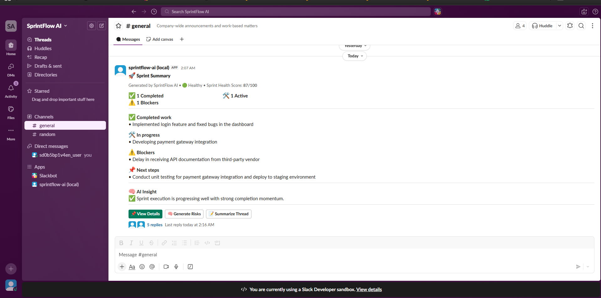
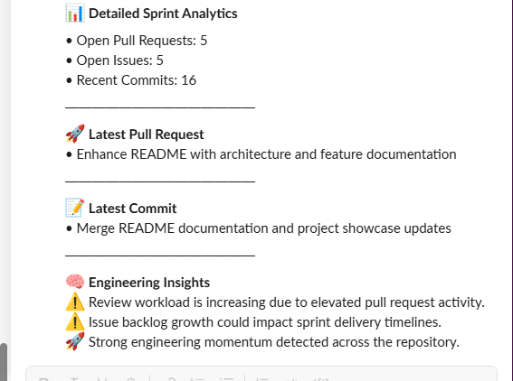
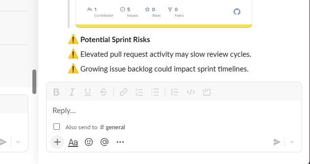
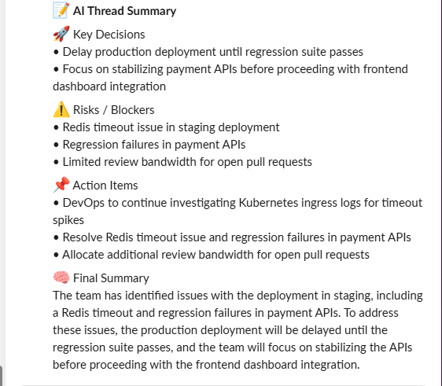

# 🚀 SprintFlow AI

AI-powered engineering sprint intelligence inside Slack.

SprintFlow AI helps engineering teams summarize sprint activity, detect delivery risks, analyze GitHub engineering activity, and extract actionable operational insights directly within Slack workflows.

The platform combines Slack-native interactions, AI-powered reasoning, GitHub analytics, and contextual thread summarization to improve sprint visibility and engineering coordination.

---

# ✨ Features

## 🧠 AI Sprint Summaries

Generate structured sprint updates including:

- Completed work
- Active tasks
- Blockers
- Next steps
- AI-generated insights
- Sprint health indicators

---

## 📊 GitHub Engineering Analytics

Analyze real engineering activity directly from GitHub:

- Pull Requests
- Open Issues
- Commit activity
- Engineering momentum
- Repository workload trends

---

## ⚠️ Dynamic Risk Detection

Automatically identify sprint delivery risks such as:

- Review bottlenecks
- Elevated issue backlog
- Reduced engineering momentum
- Sprint execution concerns

---

## 📝 AI Thread Summarization

Summarize Slack engineering discussions into:

- Key decisions
- Risks/blockers
- Action items
- Operational summaries

---

## 🎯 Slack-Native Workflow

Built directly inside Slack using:

- Slash commands
- Interactive buttons
- Thread-aware workflows
- Block Kit UI
- Real-time engineering context

---

# 🏗️ Architecture

```text
Slack Workspace
      ↓
Slack Bolt SDK (Node.js)
      ↓
SprintFlow AI Engine
      ↓
Groq LLM API + GitHub REST API
      ↓
Sprint Intelligence Layer
      ↓
Insights • Risks • Analytics • Summaries
```

---

# 🛠️ Tech Stack

- Slack Bolt SDK
- Node.js
- Groq API (Llama 3.3 70B)
- GitHub REST API
- Axios
- Block Kit UI
- Slack CLI

---

# 🚀 Core Workflow

## `/daily-summary`

Generates:

- Sprint summary
- Engineering insights
- Sprint health score
- Dynamic GitHub analytics
- Actionable operational updates

---

# 📸 Screenshots

## 🧠 Sprint Summary Dashboard



Shows:
- AI-generated sprint summary
- Sprint health indicators
- AI insights
- Interactive Slack workflows

---

## 📊 Detailed Sprint Analytics



Shows:
- Pull request analytics
- Issue tracking
- Commit activity
- Engineering insights

---

## ⚠️ Dynamic Risk Detection



Shows:
- Delivery risk analysis
- Sprint blockers
- Engineering workload concerns

---

## 📝 AI Thread Summarization



Shows:
- Key decisions
- Risks/blockers
- Action items
- AI operational summaries

---

# ⚙️ Setup Instructions

## 1. Clone Repository

```bash
git clone https://github.com/Atul-8115/Sprintflow-ai-demo.git
```

---

## 2. Install Dependencies

```bash
npm install
```

---

## 3. Configure Environment Variables

Create `.env`

```env
SLACK_BOT_TOKEN=
SLACK_APP_TOKEN=
GROQ_API_KEY=
GITHUB_TOKEN=
GITHUB_OWNER=
GITHUB_REPO=
```

---

## 4. Run Application

```bash
slack run
```

---

# 💡 Problem Statement

Engineering teams often lose visibility across:

- Slack discussions
- GitHub activity
- Sprint blockers
- Deployment risks
- Operational updates

SprintFlow AI centralizes engineering intelligence directly inside Slack to improve sprint visibility, operational awareness, and team coordination.

---

# 🎥 Demo Highlights

SprintFlow AI demonstrates:

- AI-powered sprint summarization
- Context-aware Slack thread intelligence
- Dynamic engineering risk detection
- GitHub activity analysis
- Operational insight generation
- Slack-native engineering workflows

---

# 🔮 Future Improvements

- Jira integration
- Deployment analytics
- Predictive sprint risk scoring
- Automated standup generation
- Multi-repository support
- Team performance insights

---

# 🏆 Hackathon Submission

Built for the Slack Agent Builder Challenge 2026.